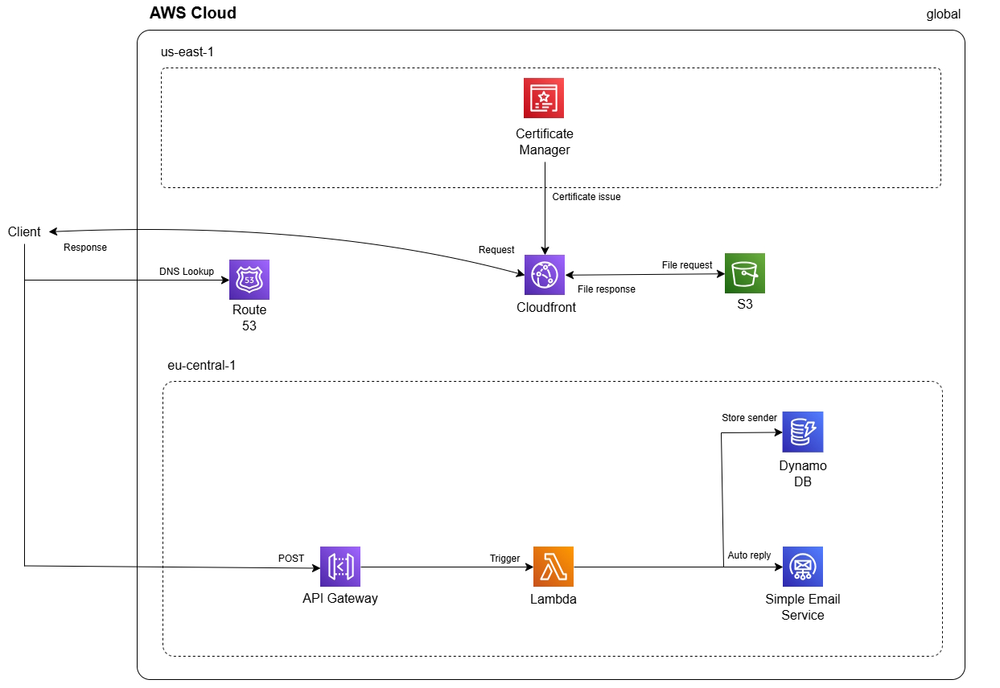

# Infrastructure as Code — Serverless AWS Stack (Terraform)

Terraform configuration that provisions a complete **serverless web stack** on AWS: a
static website behind a CDN with HTTPS, plus a serverless backend for handling contact-form
submissions.

## What it provisions

- **S3**: Used for website hosting, ensuring fast content delivery.
- **Route 53**: Configured for DNS management and domain name resolution.
- **CloudFront**: Set up as a content delivery network (CDN) to cache and serve the website.
- **ACM (AWS Certificate Manager)**: Provisioned SSL certificates for HTTPS security.
- **DynamoDB**: Used as a NoSQL database to store data.
- **Simple Email Service**: To send emails as autoreply.
- **Lambda**: Serverless functions created to handle backend operations.
- **API Gateway**: Configured to expose Lambda functions as RESTful APIs

## Tech stack

- Terraform
- AWS: S3, CloudFront, ACM, Route 53, DynamoDB, Lambda, API Gateway, IAM

## Architecture




## Getting started

Provide values for the declared variables (region, bucket name, domain name, table name,
Lambda settings) via a `terraform.tfvars` file or CLI flags, then:

```bash
terraform init
terraform plan
terraform apply
```

> Note: Requires a Lambda deployment package (`function.zip`) and a domain whose
> nameservers point at the created Route 53 zone for ACM validation to complete.
